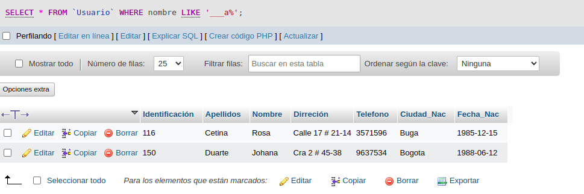

# consultas1.sql

# CONSULTAS SQL

## Tabla usuario

## COMANDO SELECT

1. Para visualizar toda la informacion que contiene la tabla `usuario`s se puede incluir con lainstruccion SELECT el caracter '*' o cada uno de los campos de la tabla

`select * from usuario`

2. Visualizar solamente la identificación del usuario.

`select Identificacion from usuario`

3. si se desea obtener los registros cuya identificacion sean mayoreso iguales a 150, se debe utulizar la clausula WHERE que espicifica las condiciones que deben reunir los registros que se van a seleccionar.

`SELECT * FROM usuario WHERE Identificación>=`150`

4. si se desea obtener los registros cuyos los apellidos sean Vanegas o Cetina, se debe utilizar el operador IN que especifica los registros que se quieren visualizar de unatabla.

`SELECT apellidos FROM usuario WHERE apellidos IN ('Vanegas','Cetina')`

O se puede utilizar el operador OR.

`SELECT apellidos FROM usuario WHERE apellidos='Vanegas' OR apellidos='Cetina'`

5. si se desea obtener los registros cuya identificacion sea menor de '110' y la ciudad sea 'Cali', se debe utilizar el operador AND.

`SELECT * FROM usuario WHERE Identificacion<'110' AND ciudad_nac='Cali'`

6. si se desea obtener los registros cuyos nombres empiecen por la letra 'A', se debe utilizar el operador LIKE que utiliza los patrones '%' todos y '_' (caracter).

`SELECT * FROM usuario WHERE nombre LIKE 'A%'`

7. si desea obtener los registros cuyos nombres contengan la letra 'a'.
`SELECT * FROM usuario WHERE nombre LIKE '%a%'`

8. si se desea obtener los registros donde la cuarta lletra del nombre sea una 'a'.

`SELECT * FROM usuario WHERE nombre LIKE '___a%'`

9. si se desea obtener los registros cuya identificacio este entre el intervalo 110 y 150, se debe utilizar la clausula BETWEEN, que sirve para espicificar un intervalo de valores.

`SELECT * FROM usuario WHERE Identificación '110` AND '150'

## COMANDO DELETE

10. Para eliminar solamente los registros suya identificacion sea mayor de 130.

`DELETE FROM usuario WHERE Identificación>'130'`

## COMANDO UPDATE

11. Para actualizar la ciudad de nacimiento de Cristian Vanegas, cuya Identificación es 114.

`UPDATE usuario SET ciudad nac = 'Manizales' WHERE Identificación='114'`

## INNER JOIN

Permite obtener datos de dos o mas tablas.Cuando se realiza la concatenacion de las tablas, no necesariamente se deben mostrar todos los datos de las tablas.

## Tabla pedidos

12. Para visualizar los campos identificacion, nombre, apellidos de la tabla usuario y nropedido, fecha de compra, fecha de vencimiento y observacion de latabla pedidos, se debe realizar la siguiente instruccion SQL:

`SELECT usuario.Identificacion, usuario.nombre, usuario.apellidos, pedido.nropedido, pedidos.fechaCompra, pedidos.fechaVence, pedidos.observacion FROM usuario INNER JOIN pedidos ON usuario.Identificacion = pedidos.Identificacion`

